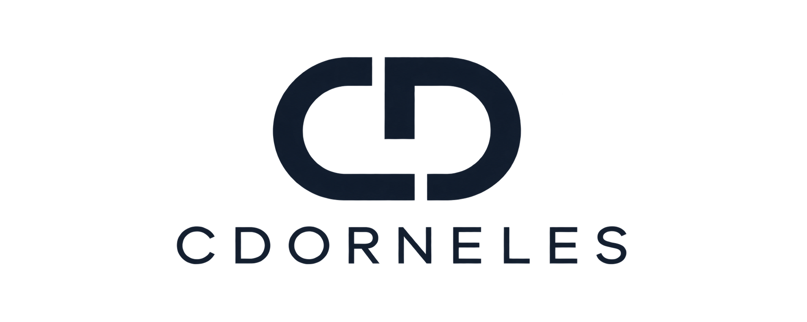

<p align="center">
  <picture>
    <source media="(prefers-color-scheme: dark)" srcset="./apps/design-system/public/brand/logo-dark.png">
    <source media="(prefers-color-scheme: light)" srcset="./apps/design-system/public/brand/logo-light.png">
    
  </picture>
</p>

# Cdorneles Platform

Multi-tenant SaaS/ERP platform: three user-facing applications, a shared design
system and an Appwrite backend.

[](https://github.com/duducp/cdorneles-platform/actions/workflows/ci.yml)

## Overview

```text
admin      internal Cdorneles administration
client     organization/tenant administration and operations
customer   end-customer experience
design-system  visual playground for the shared UI
```

The backend is Appwrite: **User** is the identity source of truth, a **Team** is
an Organization, and **Functions** are the security boundary for business
operations. Frontend authorization is UX only.

See [`ARCHITECTURE.md`](./ARCHITECTURE.md) and [`docs/decisions/`](./docs/decisions)
for the full picture. This repository currently contains the **Foundation**
(infrastructure and technical fundamentals) — no business modules yet.

## Tech stack

Next.js · TypeScript · pnpm workspaces · Mantine · Lucide · TanStack Query ·
TanStack Table · Mantine Form · Zod · Zustand · ESLint · Prettier · Vitest ·
Appwrite.

## Requirements

- Node.js `>= 22`
- pnpm `>= 11` (`corepack enable` recommended)
- [`uvx`](https://docs.astral.sh/uv/) — only for the Appwrite MCP server

## Repository structure

```text
apps/
  admin/ client/ customer/     # Next.js applications
  design-system/               # UI playground
packages/
  tokens/ theme/ ui/           # design system
  auth/ tenant/ permissions/   # platform capabilities
  api-client/                  # single Appwrite access layer
  schemas/ types/ observability/
docs/                          # architecture, ADRs, conventions
tooling/                       # shared Next.js / PostCSS config
.github/workflows/ci.yml
```

Shared packages are consumed as TypeScript source (no per-package build step);
apps list them in `transpilePackages` from `tooling/next-config.mjs`.

## Getting started

```bash
pnpm install
cp .env.example .env          # then fill in the values
pnpm dev:design-system        # http://localhost:3004
```

| App           | Command                 | Port |
| ------------- | ----------------------- | ---- |
| admin         | `pnpm dev:admin`        | 3001 |
| client        | `pnpm dev:client`       | 3002 |
| customer      | `pnpm dev:customer`     | 3003 |
| design-system | `pnpm dev:design-system`| 3004 |

## Environment variables

Copy [`.env.example`](./.env.example) to `.env` (git-ignored) and fill it in.
Only `NEXT_PUBLIC_*` values reach the browser; never put server keys in them.

| Variable                            | Scope        | Purpose                         |
| ----------------------------------- | ------------ | ------------------------------- |
| `NEXT_PUBLIC_APPWRITE_ENDPOINT`     | browser      | Appwrite endpoint               |
| `NEXT_PUBLIC_APPWRITE_PROJECT_ID`   | browser      | Appwrite project id             |
| `APPWRITE_API_KEY`                  | **server**   | Appwrite API key (never expose) |
| `NEXT_PUBLIC_SENTRY_DSN`            | browser      | Sentry DSN (optional)           |
| `SENTRY_AUTH_TOKEN`                 | **server**   | Sentry source-map upload token  |

## Appwrite MCP (project-scoped)

This repository configures the Appwrite MCP server for opencode so agents can
inspect and manage the backend. Configuration lives in
[`opencode.json`](./opencode.json) and is scoped to the project (it overrides
any global `appwrite` MCP entry).

The MCP server runs `uvx mcp-server-appwrite` and needs three variables:
`APPWRITE_ENDPOINT`, `APPWRITE_PROJECT_ID`, `APPWRITE_API_KEY`.

**Values come from `.env`, never from the repository.** opencode resolves
`{env:VAR}` only from the shell environment, not from `.env` files, so
[`.opencode/plugin/appwrite-env.ts`](./.opencode/plugin/appwrite-env.ts) loads
`.env` and injects the values into the MCP environment. `.env` stays the single
source of truth for the apps and for the MCP.

```text
.env  ──►  .opencode/plugin/appwrite-env.ts  ──►  mcp.appwrite.environment
```

To point the MCP (and the apps) at another environment, edit `.env` and
**restart opencode** — configuration and plugins are loaded once at startup.

Verify the resolved configuration:

```bash
opencode debug config | grep APPWRITE_
```

The current setup targets a **self-hosted** Appwrite instance. Production values
are not committed; they are supplied through `.env`.

## Scripts

```bash
pnpm lint          # ESLint (flat config)
pnpm typecheck     # tsc --noEmit, all workspaces
pnpm test          # Vitest (unit tests)
pnpm build         # next build, all apps
pnpm format        # Prettier write
pnpm format:check  # Prettier check
```

## Quality gates

CI (`.github/workflows/ci.yml`) runs, in order: `install` → `lint` →
`typecheck` → `test` → `build`, using pnpm with the lockfile cached.

## Documentation

- [`AGENTS.md`](./AGENTS.md) — engineering rules for agents and contributors
- [`ARCHITECTURE.md`](./ARCHITECTURE.md) — system architecture
- [`DEFINITION_OF_DONE.md`](./DEFINITION_OF_DONE.md) — completion checklist
- [`CONTRIBUTING.md`](./CONTRIBUTING.md) — contribution workflow
- [`docs/decisions/`](./docs/decisions) — architecture decision records

## Deferred (pending approval)

- Appwrite SDK adapter in `@cdorneles/api-client`
- Sentry provider in `@cdorneles/observability`
- Production Appwrite roles, permissions, features and domains
- Business modules (customers, orders, invoices, …)
